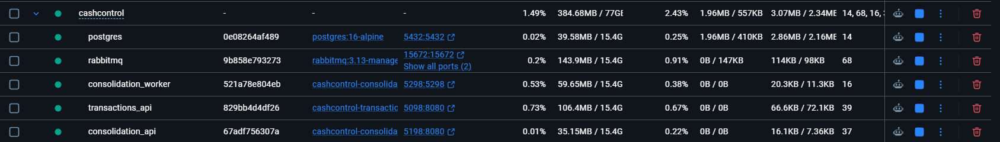
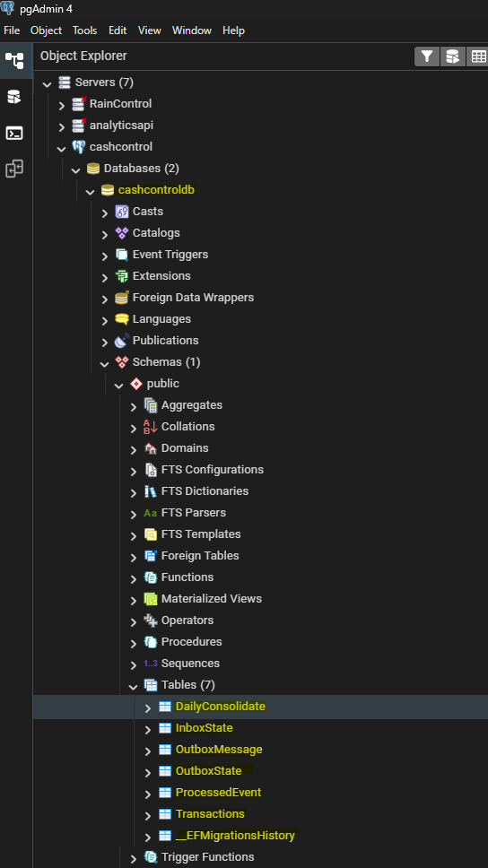
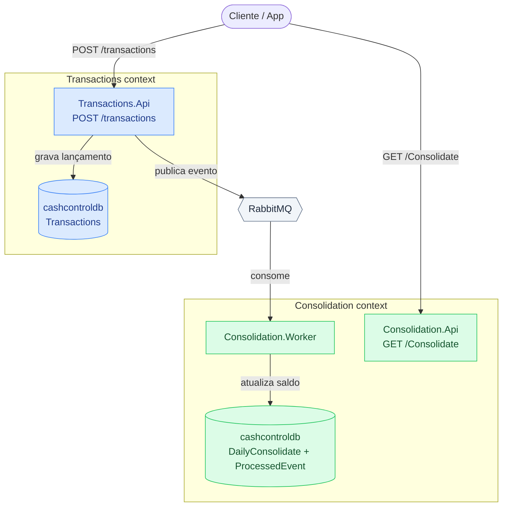

# 🚀 CashControl

> Aplicação para controle de fluxo de caixa diário. Registra crédito, débito e calcula saldo diário.

---

## 🛠️ Tecnologias Utilizadas

* [.NET 10.0](https://dotnet.microsoft.com/)
* [ASP.NET Core Web API](https://microsoft.com)
* [Entity Framework Core](https://microsoft.com) (ORM)
* [xUnit Test]
* [PostgreSQL] (Banco de dados)
* [RabbitMQ] (Mensageria)
* [Docker] (Container)

---

## ⚙️ Como Executar o Projeto

1. **Clone o repositório:**
   ```bash
   git clone https://github.com/Sossai/CashControl
   ```

2. **Subir docker e deployar a solução :**
   ```bash
   docker compose up -d --build
   ```

   

3. **Abrir o Package Manager Console do Visual Studio e aplicar as migrações:**
   ```bash
   Update-Database -Project Transactions.Infrastructure -StartupProject Transactions.Api	
   Update-Database -Project Consolidation.Infrastructure -StartupProject Consolidation.Api
   ```

   
   
4. **Para enviar uma transação, acesse o swagger da aplicação Transactions.Api e clique em "Try it out" em seguida altere os valores como o exemplo abaixo e clique em Execute.**
Swagger : 
- registro das transações => http://localhost:5098/swagger/index.html 
- consulta consolidado : http://localhost:5198/swagger/index.html

   

   ```bash
    {
        "date": "2026-08-16",
        "type": 1,
        "amount": 100,
        "description": "Adiconando 100 de Crédito"
    }
   ```

   ```bash
   type = 1 ==> Credit
   type = 2 ==> Debit
   ```

5. **Para consultar um valor consolidado, acesse o swagger da aplicação Consolidation.Api e clique em "Try it out" em seguida preencha o campo com a data que deseja consultar e clique em Execute**


   ```bash
   2026-08-16
   ```

---

## 📦 Estrutura do Projeto

```text
src/Transactions
 ├── Transactions.Api
 ├── Transactions.Application
 ├── Transactions.Domain
 ├── Transactions.Infrastructure
src/Consolidation
 ├── Consolidation.Api
 ├── Consolidation.Application
 ├── Consolidation.Domain
 ├── Consolidation.Infrastructure
 ├── Consolidation.Worker
src/Shared
 ├── Shared
tests/
 └── TransactionTests
 └── ConsolidationTests

```


## 📦 Desenho da solução


---

## 📌 Fluxo da solução e recursos utilizados
1. Aplicação Transaction.Api recebe uma requisição **HTTP POST** em /Transactions informando o valor e o tipo de operação (débito ou crédito).
2. Valida a requisição utilizando **FluentValidation**.
3. Registra tanto requisição quanto a mensagem a ser enviada, na mensageria, no banco **Postgrees**. Utilizando **pattern Transactional Outbox**, implementado pelo **RabbitMQ**, garantimos que toda informação inserida no sistema será publicada na mensageria.
4. Aplicação Consolidation.Worker consome a mensagem, valida Idempotência e insere/atualiza o saldo diário no banco.
5. Para recuperar o valor consolidado, podemos fazer uma requisição **HTTP GET** em /Consolidate passando a data desejada.
6. ** Regras de Resiliência implementadas **
- Retry exponencial no RabbitMQ.
- Polly ao inserir registros no banco.

---

## 💻 Healthcheck para verificar status das aplicações e infra
```bash
Transactions Api => http://localhost:5098/health/ready
Copnsolidation Api => http://localhost:5198/health/ready
RabbitMq Consumer => http://localhost:5298/health/ready
```
---
## 📋 Melhorias e débitos técnicos

```text
1. **Implementar uso do Redis:** Salvar o valor consolidado no Redis para um melhor desempenho e não precisar acessar o banco constantemente.
2. **Implementar DLQ:** Implementar uso da Dead Letter Queue.
3. **Logs e Observabilidade:**
4. **Controle de cobertura de código:**
5. **Aplicar regra de TTL no banco para evitar crescimento sem controle:**
6. **Implementar controle de autenticação e autorizacão:** 
```