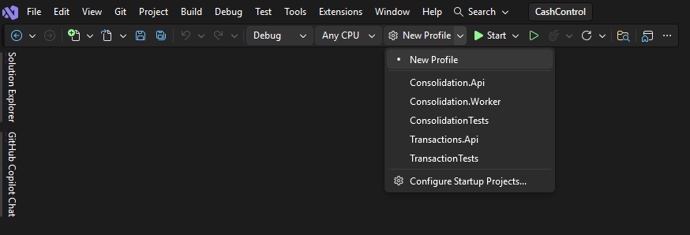
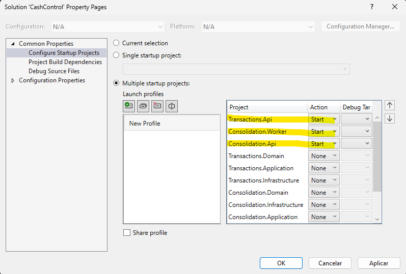
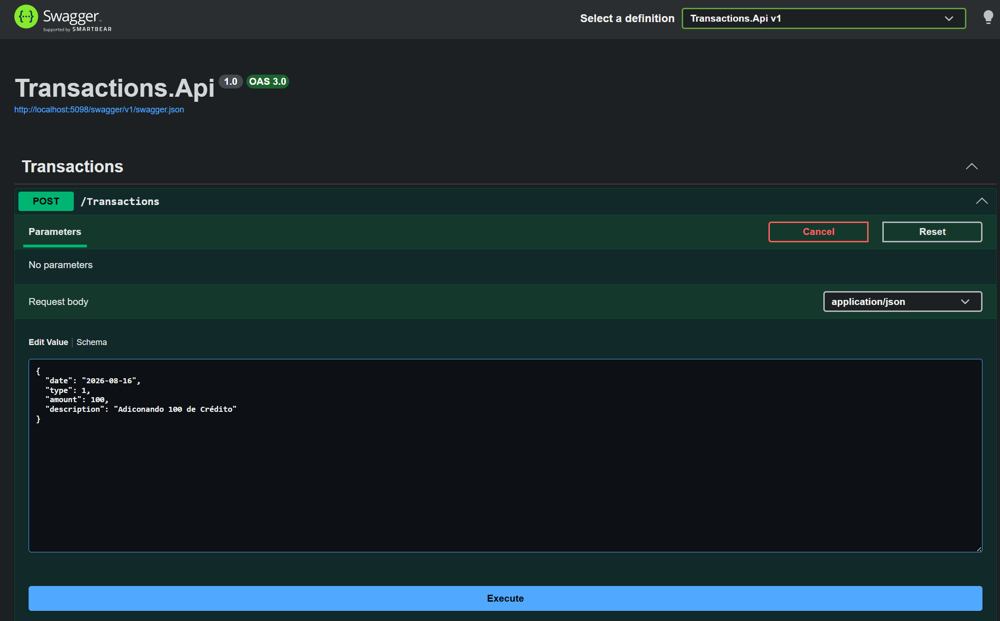
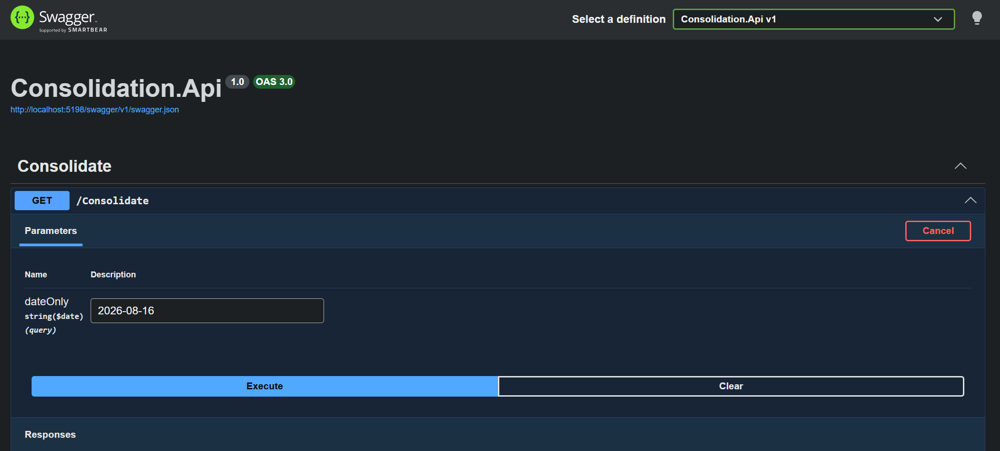
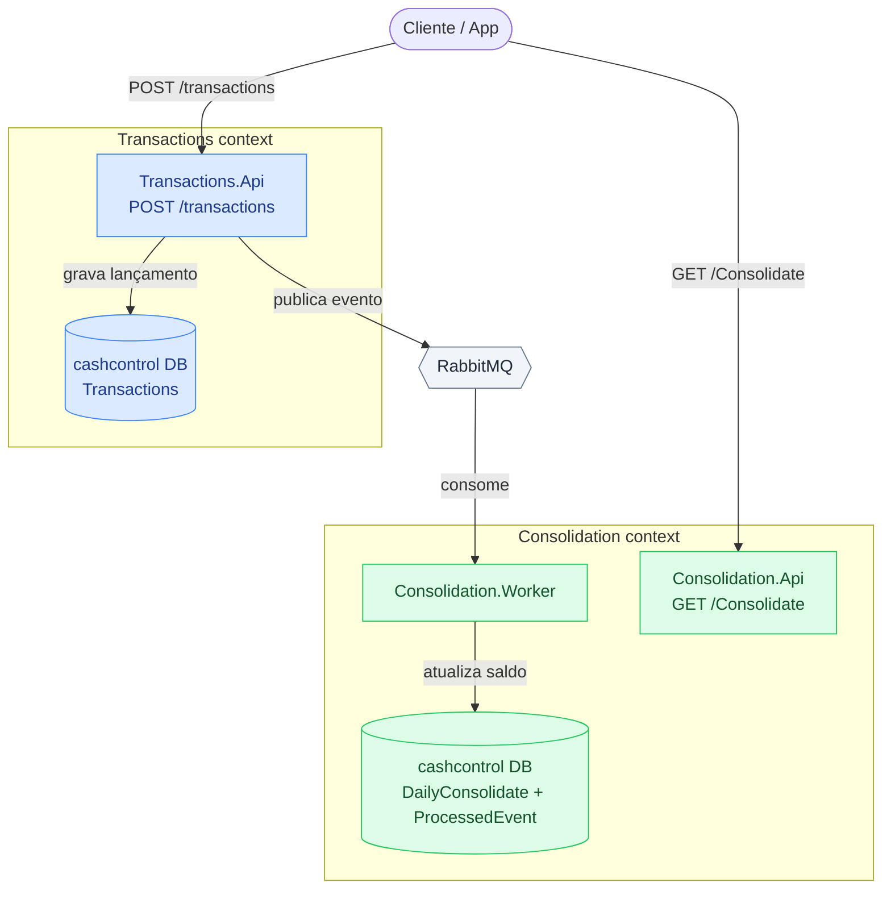

# 🚀 CashControl

> Aplicação para controle de fluxo de caixa diário. Registra crédito, débito e calcula saldo diário.

---

## 🛠️ Tecnologias Utilizadas

* [.NET 10.0](https://dotnet.microsoft.com/)
* [ASP.NET Core Web API](https://microsoft.com)
* [Entity Framework Core](https://microsoft.com) (ORM)
* [xUnit Test]
* [PostgreSQL] (Banco de dados)
* [RabbitMQ] (Mensageria)
* [Docker] (Container)

---

## ⚙️ Como Executar o Projeto

1. **Clone o repositório:**
   ```bash
   git clone https://github.com/Sossai/CashControl
   ```

2. **Subir a infraestrutura:**
   ```bash
   docker compose up -d
   ```

3. **Configure o Visual Studio para executar múltiplos startups:**

  

  

4. **Execute a aplicação: F5 no Visual Studio**

Swagger : 
- registro das transações => http://localhost:5098/swagger/index.html 
- consulta consolidado : http://localhost:5198/swagger/index.html

5. **Para enviar uma transação, acesse o swagger da aplicação Transactions.Api e clique em "Try it out" em seguida altere os valores como o exemplo abaixo e clique em Execute.**

   

   ```bash
    {
        "date": "2026-08-16",
        "type": 1,
        "amount": 100,
        "description": "Adiconando 100 de Crédito"
    }
   ```

   ```bash
   type = 1 ==> Credit
   type = 2 ==> Debit
   ```

6. **Para consultar um valor consolidado, acesse o swagger da aplicação Consolidation.Api e clique em "Try it out" em seguida preencha o campo com a data que deseja consultar e clique em Execute**



---

## 📦 Estrutura do Projeto

```text
src/Transactions
 ├── Transactions.Api
 ├── Transactions.Application
 ├── Transactions.Domain
 ├── Transactions.Infrastructure
src/Consolidation
 ├── Consolidation.Api
 ├── Consolidation.Application
 ├── Consolidation.Domain
 ├── Consolidation.Infrastructure
 ├── Consolidation.Worker
src/Shared
 ├── Shared
tests/
 └── UnitTests

```


## 📦 Desenho da solução


---

## 📋 Melhorias e débitos técnicos

```text
1. **Implementar o pattern Transacional outbox:** Gravar em banco tanto o lançamento(transaction) quanto o evento na mesma transação. Um processo rodando em background recupera os evento do banco e publica na mensageria. 
Objetivo de garantir que tudo que foi persistido no banco Transaction seja publicado na mensageria.
2. **Implementar uso do Redis:** Salvar o valor consolidado no Redis para um melhor desempenho e não precisa bater no banco constantemente.
3. **Implementar DLQ:** Implementar uso da Dead Letter Queue.
5. **Logs e Observabilidade:**
6. **Controle de cobertura de código:**
7. **Aplicar regra de TTL no banco para evitar crescimento sem controle:**
8. **Implementar controle de autenticação e autorizacão:** 
```